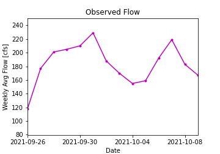
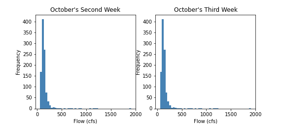
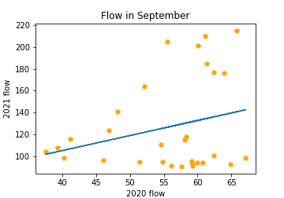

# Forecast_Submissions

## Name: Xiang Zhong

### Date: 10/11/2021

### Assignment Number: 7

---
#### Instruction for Evaluator
Step 1: Please help download the historical observed streamflow up to Saturday (10/9/2021) from https://waterdata.usgs.gov/nwis/dv?referred_module=sw&site_no=09506000 (make sure click "Tab-separated" and change Begin date as "1989-1-1" and End date as "2021-10-9") and save it at /homework-Cetaini/data (name it as "streamflow_week7.txt").

Step 2: Please run Zhong_HW7.py to get the forecast value for next week ([Enter "Forecast_Week1" here]), and for another week ahead ([Enter "Forecast_Week2" here]).

---

### Plot #1

The first plot is for the time series in recent two weeks. Take the average as the first parameter.

### Plot #2

The second plot is histograms for historical 10/8-10/15, and for 10/16-10/22. Take the mode values for each category as the second parameter

### Plot #3

The Last plot is a scatterplot between September flow in the current year and which in last year. Try to establish a linear relationship between the two series, and get the third parameter from the predicted value.

---
###Summary
This time I used a weighted average method to get the forecast value, and wrote it as a function. All forecast parameters are extracted from the plots.

---
###Code Review:
1. Is the script easy to read and understand?
- Are variables and functions named descriptively when useful?
- Are the comments helpful?
- Can you run the script on your own easily?
- Are the doc-strings useful?
  [Answer here]
2. Does the code follow PEP8 style consistently?
- If not are there specific instances where the script diverges from this style?
  [Answer here]
3. Is the code written succinctly and efficiently?
- Are there superfluous code sections?
- Is the use of functions appropriate?
- Is the code written elegantly without decreasing readability?
  [Answer here]
