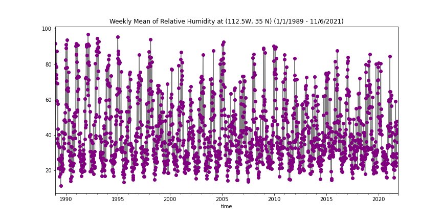

# Forecast_Submissions

## Name: Xiang Zhong

### Date: 11/7/2021

### Assignment Number: 11

____
### Grade
3/3 - Nice job!  I like how you tried to encorporate this into your linear regression model too. 

____________
### Summary
This time I still used the weighted average to get the forecast value. The average of recent two weeks are the first parameters. Mode values for historical November's second and third week stream flow are the second parameters. The third parameter is the predicted values from relative humidity. Because the relationship is not significantly linear, I used cases with only RH between 18% and 19% to build the relationship.

The final predicted value for next week and for next next week are both 129 cfs.

---
### NetCDF Dataset Added
The dataset I added this time is the NCEP reanalysis daily average of relative humidity from 1/1/1989 to 11/6/2021.

The reason why I chose this data is because humidity naturally relates with precipitation and evaporation, that will affect the flowstream.

The spatial resolution for the dataset is 2.5 degree for both longitude and latitude. Temporal resolution is daily average. The extent of the data is (247.5 °E, 35 °N) to (250 °E, 35 °N).

I downloaded the data from PSL's website (https://psl.noaa.gov/cgi-bin/db_search/SearchMenus.pl).

I tried to build blish a linear relationship model between the relative humidity and the stream flow and use the model to make a prediction.

### Time Series of the Dataset I added

This is the weekly average of relative humidity at the nearest grid for our streamflow gauge station.

This is plot is added onto our slide deck also.
