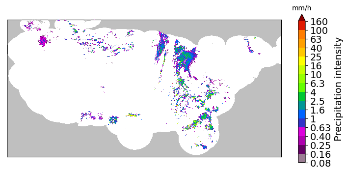
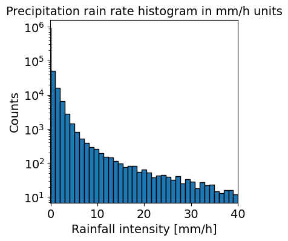
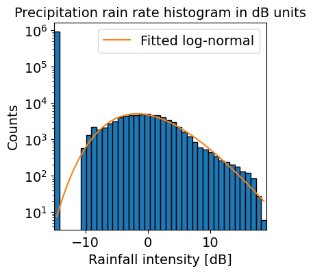

# Forecast_Submissions

## Name: Xiang Zhong

### Date: 11/29/2021

### Assignment Number: 14
____________
### Summary
1. What is the paper or project you picked? Include a title, a link the the paper and a 1-2 sentence summary of what its about.
   Paper title: Skilful precipitation nowcasting using deep generative models of radar
   Link: https://www.nature.com/articles/s41586-021-03854-z
   Summary: This study presents a deep generative model for the probabilistic nowcasting of precipitation from radar. Then they used statistical, economic and cognitive measures to show their methods' improvement of forecast quality, consistency and forecast value.

2. What codes and/or data are associated with this paper? Provide any link to the codes and datasets and a 1-2 sentence summary of what was included with the paper (i.e. was it a github repo? A python package?A database? Where was it stored and how?)
   They used a daset of radar for the UK from the Met Office RadarNet4 network and some quantitative verification data as they described in their paper's Methods part. 
   The authors provided their python framework for short-term ensemble prediction systems at: https://github.com/pySTEPS/pysteps.

3. Summarize your experience trying to understand the repo: Was their readme helpful? How was their organization? What about documentation within the code itself?
   Their readme is very helpful. They have a very nice structure of the entire repo introduced what is and how to work with this repo. The code is well documented too.

4. Summarize your experience trying to work with their repo: What happened when you tried to run it? Where you successful? Why or why not?
   I tried to run the my_first_nowcast.ipynb as their example of nowcasting model application under the path of https://github.com/pySTEPS/pysteps/tree/master/examples.

   The first problem met was I did not install c++ on my computer, the vs code hinted me to install Visual Studio Installer to intall Desktop development with C++. After this, the pystep package could be intalled. Then I get some figures as shown in my_first_nowcast.ipynb in my cloned their repo now.
   
   
   

   But somehow when download the source data went wrong and modules beginning from "Compute the Nowcast" all went wrong. I got no extra time fixing that so just leave it there.

5. Summarize your experience working with the data associated with this research. Could you access the data? Where was it? Did it have a DOI? What format was it in?
   I downloaded some source data successfully and got some figures. Those are realized by API so I just ran the code and it helped downloaded the data automatically.

   The authors did not provide a DOI for the data, not sure if it has one or not.

   The data was downloaded and read as numpy arrays.

6. Did this experience teach you anything about your own repo or projects? What suggestions would you give to the authors for how they could do better next time?
   Yes. Using API to download data is convenient but risky, as data will update and sometimes the structure will change. My suggestion is to provide key structure of current data as this will affect later calculations. Also, try to download the data and share it from ftp or something will be more stable. The author has already listed and even wrote for other people to preset the environment, but they could add a hint of the necessary of c++. Overall, I believe this repo is very well structured and wrote and worth to imitate as a beginner.
