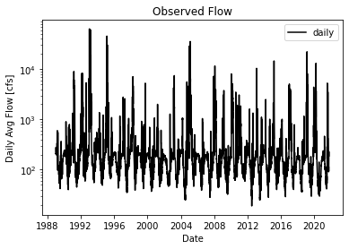
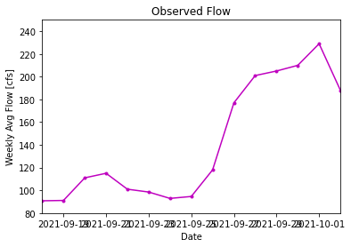
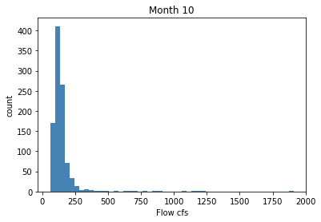
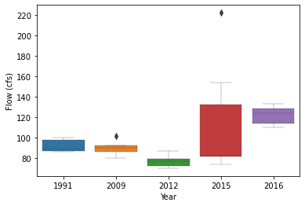
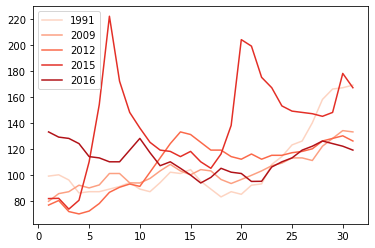
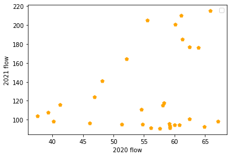

# Forecast_Submissions

## Name: Xiang Zhong

### Date: 10/4/2021

### Assignment Number: 6

________
## Grade
1/3: Nice work, I like your logic here, but your plots didn't come through. We will discuss this in class tomorrow and you can resubmit for full credit. 
_________

### Plot #1

First take a glimpse of the data through its full time series. I have only changed the line style and color, but used a terser syntax. This plot offers a thorough idea of how flows change over time, and there is an obvious annual cycle.

### Plot #2

The first time series is too coarse, so I took a deeper look at more recent periods. The result shows an increasing trend for last two weeks but a decline trend at last day. So probably, the value will be smaller than 180.

### Plot #3
 

Then a histogram of October shows that normally flows in October will be around 120 or so.

### Plot #4
 

This plot shows October flows in years that share a similar flow in September with this year's. There are only five years share a similar fow in September, and basically those years' October flows are smaller than 130, but higher than 75 or so.

### Plot #5

These are the same selected years, but showed in a multiple lines way. Through this plot, we can tell October flows are basically lower than 120, but higher than 70 or so.

### Plot #6
 

In this plot, I tried to establish a linear relation between this year's September flow with last year's, and a predicted value is 214.80.

_________

        Combine all the information above (smaller than 180; around 120 or so; smaller than 130, but higher than 75 or so; lower than 120, but higher than 70 or so; 214.80), my last predicted value for next week is: 150. Value for next next week is 150 also.