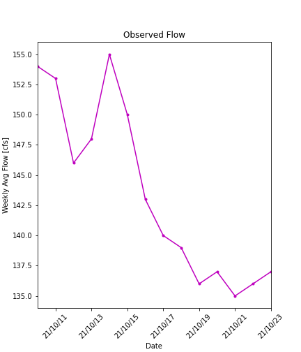
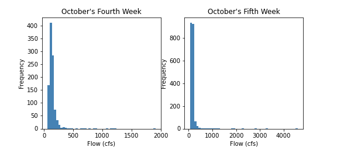
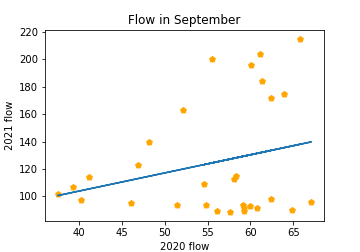
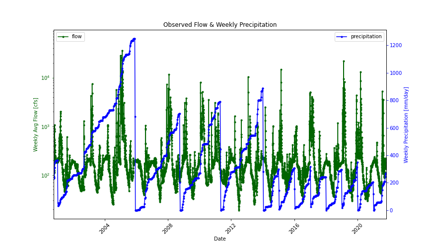

# Forecast_Submissions

## Name: Xiang Zhong

### Date: 10/25/2021

### Assignment Number: 9
____________

## Grade:
**2.5/3:** Good work. I really like how you did the plotting on two axes. I subtracted 0.5 points becuase I don't see where you answer question 2 from the assignment explaining your additional dataset and how you accessed it.  Also, I didn't subtract points but I'm a little curious about your weekly precipitation values. Are they cumulative or something? The pattern in time with the sudden drops is a little odd to me. 
____________

### Plot #1

The first plot is for the time series in recent two weeks.

Take the average as the first parameter.

### Plot #2

The second plot is histograms for historical 10/24-10/30, and for 10/31-11/6.

Take the mode values for each category as the second parameter

### Plot #3

The third plot is a scatterplot between September flow in the current year and which in last year.

Try to establish a linear relationship between the two series, and get the third parameter from the predicted value.

### Plot #4

The last plot is the timeseries of the flow and the precipitation for the overlappting period of both data. The value is weekly average.

Fourth parameter is extracted from a learning model build between flow value and lag-1 precipitation and lag-2 precipitation value separately.

---
### Summary
This time I used a weighted average method to get the forecast value, and wrote it as a function. Forecast parameters are described above.

The final predicted value for next week is 162, for next next week is 167 cfs.
