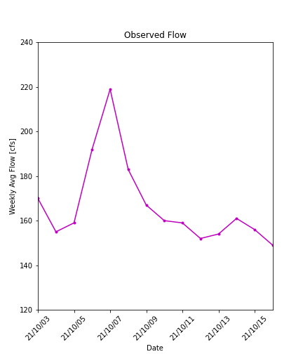

# Forecast_Submissions

## Name: Xiang Zhong

### Date: 10/18/2021

### Assignment Number: 8

____________
## Grade:
### 1. Forecast Submision: 
**3/3:** Nice work, I like your graphs!
 
### 2. Graded Script
Refer to [the rubric](https://github.com/HAS-Tools-Fall2021/Course-Materials21/blob/main/Content/Starter_Codes/week7_code_review_rubric.md) for details on scoring: 
- **Readability: 3/3** Very good. Excellent job with comments and doc strings.
- **Style: 3/3** No Pep8 errors
- **Code: 3/3** I was able to run your script with no issies. I like your function and how you are using the regression model really cool!
____________

### Plot #1

The first plot is for the time series in recent two weeks.

Take the average as the first parameter.

### Plot #2

The second plot is histograms for historical 10/17-10/23, and for 10/24-10/30.

Take the mode values for each category as the second parameter

### Plot #3

The Last plot is a scatterplot between September flow in the current year and which in last year.

Try to establish a linear relationship between the two series, and get the third parameter from the predicted value.

---
### Summary
This time I used a weighted average method to get the forecast value, and wrote it as a function. All forecast parameters are extracted from the plots.

Last week my partner suggested me to move the self-defined function to the top of the script below "import packages". I have moved accordingly, and changed the format of doc string by referring to those written in "eval_functions.py".

For timeseries functionality. At first, I imported "datetime", and "DateFormatter" from "matplotlib.dates". Then I used "parse_dates" to set the datetime column as datetime format, and set it as the index column.

For Plot #1, I used "DateFormatter" to set the format of the datetime, and later applied in the plot. The setting of xlim using "datetime.date" helped to slice the period I want to show in the plot. I also learned how to rotate the xticklabels when doing training acitivity this week, instead of just setting max number of xlabels.

The "data.index.month" attribute helped to easily subset data in the month I want. Same as ".year", ".day". 

The part of my script that I am most proud of is the self-defined function. Because I love the format I have learned to write this week, and now it looks neat and easy to read. The rotation of xticklabels are also fun.

---
### Code Review:
1. Is the script easy to read and understand?
- Are variables and functions named descriptively when useful?  
- Are the comments helpful?  
- Can you run the script on your own easily?  
- Are the doc-strings useful?

2. Does the code follow PEP8 style consistently?
- If not are there specific instances where the script diverges from this style?

3. Is the code written succinctly and efficiently?
- Are there superfluous code sections?
- Is the use of functions appropriate?
- Is the code written elegantly without decreasing readability?

